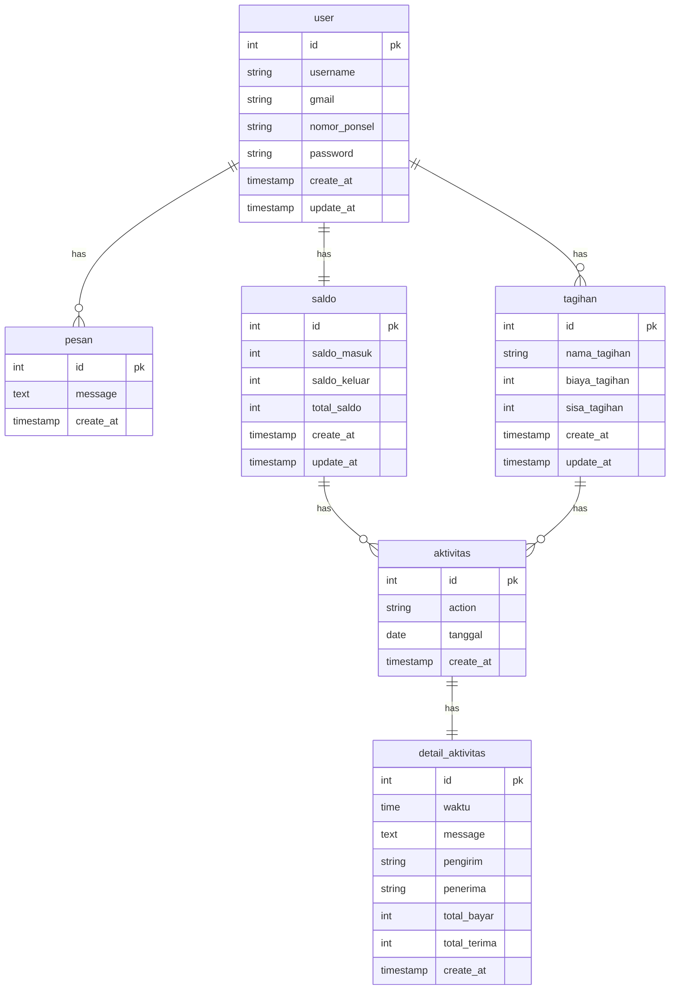

# ERD Perpustakaan

```mermaid
erDiagram
user {
    int id pk
    string username
    string gmail
    string nomor_ponsel
    string password
    timestamp create_at
    timestamp update_at
}

pesan {
    int id pk
    text message
    timestamp create_at
}

saldo {
    int id pk
    int saldo_masuk
    int saldo_keluar
    int total_saldo
    timestamp create_at
    timestamp update_at
}

tagihan {
    int id pk
    string nama_tagihan
    int biaya_tagihan
    int sisa_tagihan
    timestamp create_at
    timestamp update_at
}

aktivitas {
    int id pk
    string action
    date tanggal
    timestamp create_at
}

detail_aktivitas {
    int id pk
    time waktu
    text message
    string pengirim
    string penerima
    int total_bayar
    int total_terima
    timestamp create_at
}

user ||--|| saldo : has
user ||--o{ pesan : has
user ||--o{ tagihan : has

saldo ||--o{ aktivitas : has
tagihan ||--o{ aktivitas : has

aktivitas ||--|| detail_aktivitas : has
```
